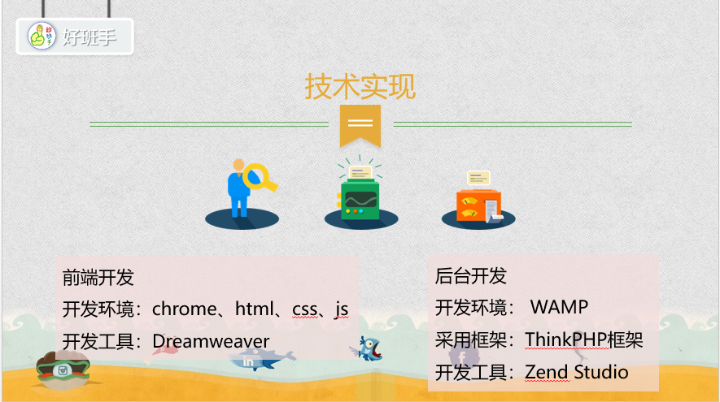

# hbs好班手

###在项目调查中显示
有81.48%的班委遇到班级凝聚力和学习氛围的问题，有74.07%的班委遇到举办活动的问题，有42.59%的班委遇到班级考勤的问题，有60.22%的同学没认齐班里的同学，有56.91%的同学认为班级活动无聊，49.72%的同学抱怨没有班级间的联谊活动。基于以上存在的问题，好班手微信公众号开发是存在需求的。

###好班手采用微信公众号形式
操作简单，无需下载安装，成本低，没有手机系统问题。

###风险与竞争
**在风险上**，2017微信公众号8大发展趋势中提到内容营销更加难，获取用户成本更高，微信小程序与微信公众号之间的小竞争，面临这些风险，我们会趋利避害，完善用户体验，注重好班手的实用性，突出考勤功能的特色。
**在竞争上**，微班级主要功能在于班级社交，爱班级更多在于辅导员对大学生的监督和学生工作，班级优化大师、智慧班级、微课掌上通等，都是注重中小学学校与家长的沟通。

###好班手微信公众号完全针对大学班级
根据班委和普通同学不同角色设置了不同的权限功能，主要针对班级最日常的工作——考勤，另外设置有增加班级凝聚力和学习氛围的功能来满足用户需求。**一方面**，微信公众号为日常考勤提供方便，保证用户使用的必要性，有利于形成稳定的用户量，**另一方面**在活动和班级间联谊等时段性需求提供帮助。
好班手在功能上设有请假，签到，考勤统计等功能，方便班委管理班级，也督促同学们的正常上课。好班手通过后期数据分析，建立相关的模型，同时研究同学们的考勤行为心理特征，为班委管理班级和制定措施提供依据，为老师如何提高课堂效率提供帮助，为学校课程设置提供合理的建议。

###在功能上
同学们可以通过一键请假来进行请假，请假记录会同步到考勤表上，当课堂需要考勤时，有地理定位签到，手动签到等方式签到，简化班委日常考勤工作，另外考勤数据可以根据不同时间导出，成excel表格。还可以分享你的活动想法，活动记录，邀请你喜欢的班级联谊，交流评论等

###在技术实现上
前端开发，我们采用了html，css，js语言，使用Dreamweaver开发工具，再后台开发上，我们基于WAMP开发环境，采用ThinkPHP开发框架实现
###效果预览
@[操作视频](./images/video.mp4)

